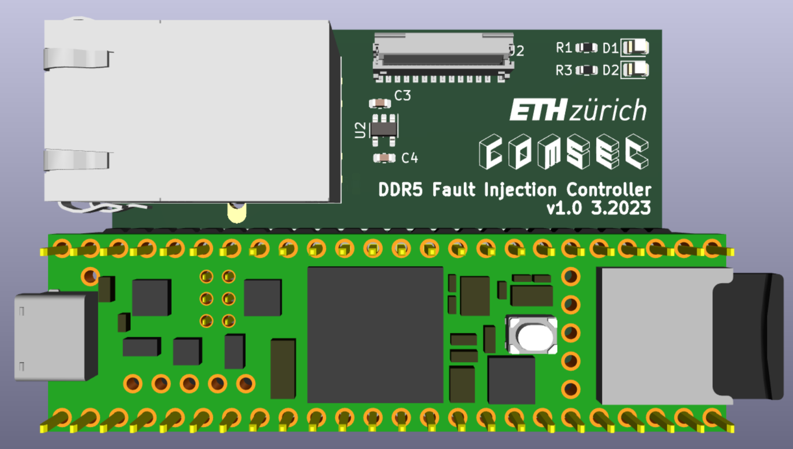
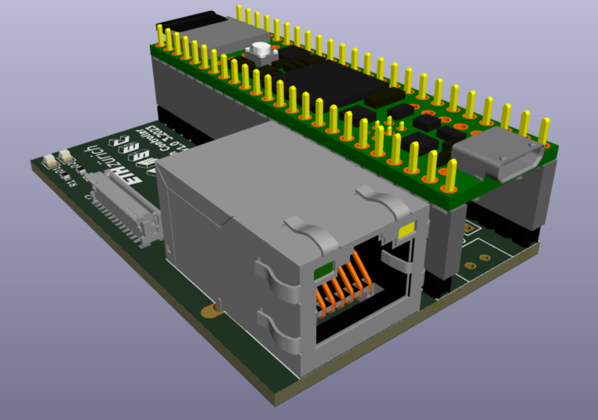

# DDR5 Injection controller
Hardware files for injection controller PCB that controls the
DDR5 interposer PCB by using a Teensy 4.1 microcontroller. This is
a 2-layer PCB.

## Design
The schematic and PCB was designed in KiCAD. Open `hardware/injection-controller.kicad_pro` in KiCAD 8 or later to view the design files.
From there, you should be able to select the schematic and PCB layout.

For convenience, you can also find a PDF version of the schematic in `docs/schematic.pdf`. A bill of materials (BOM) is also provided in `docs`.

### !!! Warning !!!
This injection controller was designed for a previous version
of interposer with a different pinout on the flat-flex connector.
This works fine as long as the software is modified accordingly,
but it means that the labels of J2 in the schematic of the injection
controller (e.g., `CA4_LOW`) are not accurate anymore.
Instead, match the pin number of J2 to the appropriate function
of the interposer that you use.
The latest fault injection interposer also requires 3.3 V instead
of 1.1V. Hence, the voltage regulator U2 should be replaced
with a 3.3V type.
To be able to power-cycle the experiment machine, we manually
added a mechanical relay with a driving transistor and flyback diode
to the PCB. Those components are not documented here.

## Features

  - **Ethernet**: RJ45 Jack connected to the Ethernet header pins of the Teensy.
 - **Pluggable Teensy**: The Teensy microcontroller board is meant to be
 attached to the PCB by using headers, allowing for easy replacement and
 swapping of microcontroller.
 - **Status LED**: One power LED and one user controllable LED on the board.
- **Flat flex connector**: By using a suitable flat flex cable, the controller
 can be easily connected to the DDR5 fault injector interposer.

## Manufacturing
The PCBs were manufactured by JLCPCB and were assembled by hand.
It is reasonable to also order a SMT stencil so soldering is easier.
The Gerber files needed for manufacturing are located at hardware/output.

### Manufactoring options
| Option  | Value   |
|---------|---------|
| Layers  |   2     |
| Dimension | 60.96 mm* 40 mm |
| Product Type | Industrial/Consumer electronics |
| Different Design | 1|
| Delivery Format | Single PCB|
| PCB Thickness | 1.6|
| Impedance Control | no|
| Layer Sequence ||
| PCB Color | Green|
| Silkscreen | White|
| Via Covering | Tented|
| Surface Finish | LeadFree HASL|
| Deburring/Edge rounding | No|
| Outer Copper Weight | 1|
| Gold Fingers | No|
| Flying Probe Test | Fully Test|
| Castellated Holes | no|
| Remove Order Number | No|
| 4-Wire Kelvin Test | No|
| Material Type | FR4-Standard TG 135-140|
| Paper between PCBs | No|
| Appearance Quality | IPC Class 2 Standard|
| Confirm Production file | No|
| Silkscreen Technology | Ink-jet/Screen Printing Silkscreen|
| Package Box | With JLCPCB logo |

## Assembly
Assembly can be done manually using a stencil (ordered with the PCB),
some solder paste and a hot air gun.
### Bill of Materials (BOM)
See docs/bom

## License
Some parts of the PCB may be subject to copyright of third parties 
(e.g. 3D models provided by manufacturer).
Otherwise, the design is released under MIT License.

The KiCad symbol and footprint libraries for the Teensy microcontroller 
are taken from [here](https://github.com/XenGi/teensy_library) 
and [here](https://github.com/XenGi/teensy.pretty), respectively (MIT License).
